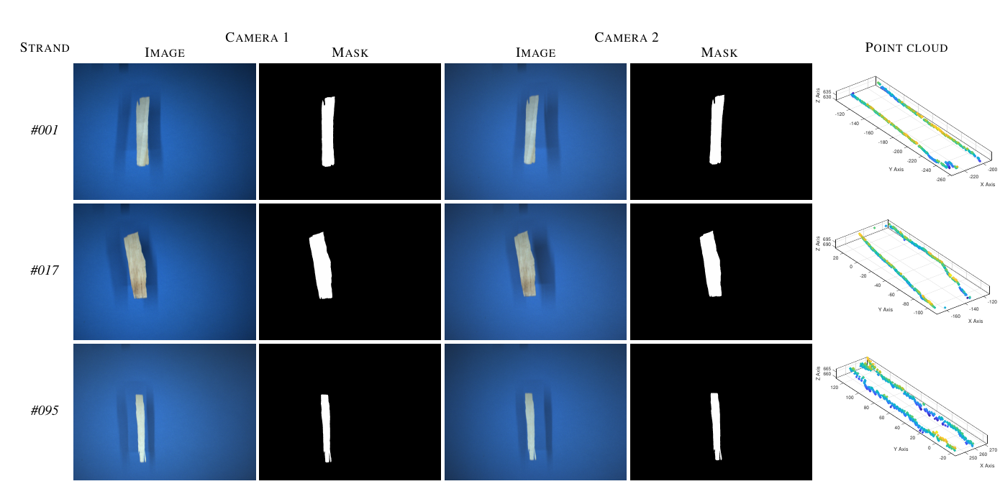
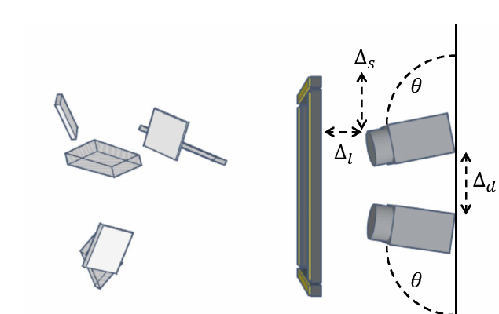
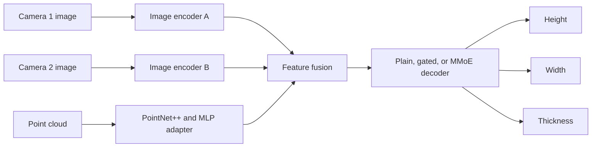

<div align="center">

# Granulo-10k

### A large-scale benchmark dataset and PyTorch baseline for multiple-view industrial granulometry

[](https://huggingface.co/datasets/AngeloUNIMI/Granulo-10k)
[](https://github.com/AngeloUNIMI/IPAN_3D)
[](LICENSE)
[](#supported-tasks)

**Granulo-10k** provides synchronized RGB images, segmentation masks, strand-level measurements, 3D point clouds, and the code used for the baseline experiments described in the accompanying paper.

</div>

---

## 🧭 Overview

Granulo-10k is designed for research on the geometric analysis of wood strands used in the production of Oriented Strand Board (OSB). The dataset supports the estimation of:

- height;
- width;
- thickness;
- compliant versus non-compliant strand category.

The repository also contains the PyTorch implementation used to evaluate convolutional networks, modern visual backbones, PointNet++ features, and multi-task decoders for joint granulometric regression.

## ✨ Dataset at a Glance

| Feature | Description |
|---|---|
| 🖼️ RGB images | **9,600** images at `1280 x 960` resolution |
| 🌲 Strands | **200** unique OSB wood strands |
| 🔁 Acquisitions | **24** acquisitions per strand |
| 📷 Views | **2 synchronized camera views** per acquisition |
| 🎯 Masks | Segmentation masks for each paired acquisition |
| ☁️ 3D data | Point clouds associated with paired acquisitions |
| 📏 Ground truth | Height, width, and thickness measurements |
| 🏷️ Labels | Compliant / non-compliant strand categories |
| 🧪 Protocol | Strand-disjoint evaluation to avoid train-test leakage |

Each strand was acquired eight times from a frontal starting position, eight times from a sideways position, and eight times from an intermediate position.

<div align="center">



</div>

## 🏗️ Acquisition System

Images were collected using a calibrated multiple-view acquisition system composed of:

- two synchronized **Sony SX90CR** color cameras
- a trigger mechanism connected to a photocell
- four LED bars for approximately uniform illumination
- calibrated camera geometry for multiple-view reconstruction

The two cameras were placed at the same height and oriented at approximately `85°` with respect to the support, with a camera distance of `125 mm`. LED bars were placed at approximately `90 mm` from the cameras.

<div align="center">



</div>

Each strand was dropped from random positions above the cameras while ensuring that it fell inside the intersection of the two fields of view. To increase acquisition variability, each strand was acquired 24 times:

```text
200 strands x 24 acquisitions x 2 cameras = 9,600 RGB images
```

## 📦 Repository Structure

```text
Granulo-10k/
├── README.md
├── LICENSE
├── figures/
│   ├── fig1_acquisition_setup.png
│   ├── fig2_dataset_examples.png
│   ├── example.png
│   └── setup.png
└── code/
    ├── cnn_osb.py
    ├── README.md
    ├── plain_exps.sh
    ├── gated_exps.sh
    ├── mmoe_exps.sh
    ├── test_resnets_original_fusion.sh
    ├── functions/
    ├── modelGeno/
    ├── util/
    └── Pointnet_Pointnet2_pytorch/
```

The root README introduces the complete dataset and repository. Additional implementation details are available in [`code/README.md`](code/README.md).

## 📥 Downloading the Dataset

The dataset can be downloaded from Hugging Face:

```python
from datasets import load_dataset

dataset = load_dataset("AngeloUNIMI/Granulo-10k")
```

Dataset page:

```text
https://huggingface.co/datasets/AngeloUNIMI/Granulo-10k
```

## 📦 Dataset Content

For each paired acquisition, Granulo-10k provides:

```text
Granulo-10k/
├── Images/        # RGB images from synchronized camera views
├── Masks/         # Segmentation masks for each view
├── PCs/           # 3D point clouds
└── README.md      # Dataset description and citation
```

Each acquisition includes:

- RGB image from camera 1
- RGB image from camera 2
- segmentation mask for camera 1
- segmentation mask for camera 2
- associated 3D point cloud
- ground-truth height, width, and thickness measurements
- compliance category
---

## 🌲 Strand Categories

The dataset includes 200 manually measured strands divided into two classes:

| Category | Number of strands | Reference average size |
|---|---:|---|
| ✅ Compliant | 100 | `h x w x t = 115 x 20 x 0.70 mm` |
| ⚠️ Non-compliant | 100 | `h x w x t = 91 x 9 x 0.65 mm` |

For each strand, maximum height and width were measured using a caliper. Since thickness can vary across the strand surface, multiple thickness measurements were collected at different points and averaged.

Download the dataset files from the Hugging Face page and arrange them according to the directory structure expected by the code, described below.

## Dataset Organization Expected by the Code

The current training script uses the following dataset root in `code/cnn_osb.py`:

```python
baseDir = '../../../data/CNN_OSB/'
```

Therefore, either place the dataset at that location relative to the `code/` directory, or update `baseDir` locally before running the experiments.

The expected structure is:

```text
../../../data/CNN_OSB/
├── DB Wood (test)/
│   └── DB_strand_IPAN3D_TII_buoni_e_sottili_JPG/
│       ├── datastore_A/
│       │   └── <class-folder>/
│       │       └── <strand>_<acquisition>_A.jpg
│       ├── datastore_B/
│       │   └── <class-folder>/
│       │       └── <strand>_<acquisition>_B.jpg
│       ├── datastore_PC/
│       │   └── <class-folder>/
│       │       ├── <strand>_<acquisition>_PC_lungh_largh.xyz
│       │       └── <strand>_<acquisition>_PC_thickness.xyz
│       └── datastore_train_test/
└── DB Wood (orig)/
    └── DB_strand_IPAN3D_TII/
        ├── Misure_buoni_e_sottili.csv
        └── Strand_per_spessore_buoni.csv
```

The image directories follow the convention required by `torchvision.datasets.ImageFolder`, so images must be placed inside at least one class subdirectory. Point clouds are plain-text `.xyz` files with three coordinate columns and are resampled to 2,048 points by the loader.

## Supported Tasks

### Strand Segmentation

Use the supplied binary masks to train and evaluate single-view or multiple-view segmentation methods.

### Multiple-View Granulometry

Estimate strand height, width, and thickness from synchronized RGB views and, when enabled by the experiment, 3D point-cloud information.

### Compliance Classification

Classify strands as compliant or non-compliant with respect to the manufacturer reference dimensions.

### Multi-Modal Geometric Learning

Study the fusion of visual and 3D representations for industrial geometric measurement.

## Baseline Architecture

The baseline combines:

- one image encoder for each camera view;
- a PointNet++ point-cloud encoder;
- an MLP adapter for point-cloud features;
- max-pooling feature fusion;
- one of three decoder variants: `plain`, `gated`, or `mmoe`;
- task-specific regression heads for height, width, and thickness;
- uncertainty-based multi-task loss weighting.



## Supported Image Backbones

### Residual Architectures

- `resnet18`
- `resnet34`
- `resnet50`
- `resnet101`
- `resnet152`
- `resnext50_32x4d`
- `resnext101_32x8d`
- `resnext101_64x4d`
- `wide_resnet50_2`
- `wide_resnet101_2`

### Foundation and Modern Architectures

- `dino_vitb14`
- `clip_vitl14`
- `eva02_clip_l14`
- `convnextv2_base`

Input resolution is selected automatically by the implementation:

| Backbone family | Input resolution |
|---|---:|
| ResNet, ResNeXt, Wide ResNet | `320 x 240` |
| DINO ViT-B/14 | `518 x 518` |
| CLIP ViT-L/14 | `224 x 224` |
| EVA02-CLIP ViT-L/14 | `336 x 336` |
| ConvNeXtV2 Base | `384 x 384` |

## Installation

A CUDA-capable GPU is strongly recommended.

Create a Python environment and install the principal dependencies:

```bash
python3 -m venv .venv
source .venv/bin/activate
python -m pip install --upgrade pip
pip install torch torchvision timm numpy scikit-learn matplotlib Pillow PyYAML
```

Install the PyTorch build suitable for the CUDA version available on the system.

## PointNet++ Checkpoint

The point-cloud encoder expects a pretrained PointNet++ classification checkpoint at:

```text
code/Pointnet_Pointnet2_pytorch/log/classification/
└── pointnet2_ssg_wo_normals/
    └── checkpoints/
        └── best_model.pth
```

The checkpoint must contain a `model_state_dict` compatible with the bundled `pointnet2_cls_ssg` implementation. It can be produced using the bundled PointNet++ training code on ModelNet40, or replaced with the checkpoint used for the experiments.

## Running the Baseline Code

Run all commands from the `code/` directory:

```bash
cd code
```

### Default Experiment

```bash
python3 cnn_osb.py
```

The default configuration uses:

- backbone: `resnet18`;
- decoder: `plain`;
- training mode: `imagenet`;
- 5 iterations;
- 50 regression epochs;
- batch size: 256;
- base learning rate: `0.0012`;
- 64 experts when the MMoE decoder is selected.

### DINO ViT-B/14 with MMoE

```bash
python3 cnn_osb.py \
  --models dino_vitb14 \
  --decoder mmoe \
  --num_experts 64 \
  --base_lr 0.0012 \
  --num_epochs_regr 50 \
  --num_iterations 5
```

### Plain Decoder

```bash
python3 cnn_osb.py \
  --models dino_vitb14 \
  --decoder plain
```

### Gated Decoder

```bash
python3 cnn_osb.py \
  --models dino_vitb14 \
  --decoder gated
```

### Multiple Backbones

```bash
python3 cnn_osb.py \
  --models resnet18 resnet34 dino_vitb14 \
  --decoder mmoe
```

### MMoE Expert Ablation

```bash
python3 cnn_osb.py --models dino_vitb14 --decoder mmoe --num_experts 1
python3 cnn_osb.py --models dino_vitb14 --decoder mmoe --num_experts 8
python3 cnn_osb.py --models dino_vitb14 --decoder mmoe --num_experts 32
python3 cnn_osb.py --models dino_vitb14 --decoder mmoe --num_experts 64
python3 cnn_osb.py --models dino_vitb14 --decoder mmoe --num_experts 128
```

## Batch Experiment Scripts

The `code/` directory includes scripts for groups of experiments:

```bash
bash plain_exps.sh
bash gated_exps.sh
bash mmoe_exps.sh
bash test_resnets_original_fusion.sh
```

Edit the `MODELS` array in the scripts to select the desired backbones.

## Main Command-Line Arguments

| Argument | Default | Description |
|---|---:|---|
| `--seed_adams` | `42` | Random seed |
| `--plotta` / `--no-plotta` | disabled | Enable or disable plotting |
| `--log` / `--no-log` | enabled | Enable or disable result logging |
| `--num_iterations` | `5` | Number of evaluation iterations |
| `--batch_size` | `256` | Training and validation batch size |
| `--batch_size_norm` | `256` | Batch size for normalization statistics |
| `--batch_size_test` | `256` | Test batch size |
| `--numWorkersP` | `8` | Number of DataLoader workers |
| `--class_switch` | `0` | Enable the optional classification stage when nonzero |
| `--num_epochs_class` | `10` | Classification epochs |
| `--num_epochs_regr` | `50` | Regression epochs |
| `--base_lr` | `0.0012` | Base learning rate |
| `--models` | `resnet18` | One or more image backbones |
| `--decoder` | `plain` | Decoder: `plain`, `gated`, or `mmoe` |
| `--num_experts` | `64` | Number of experts for MMoE |
| `--trainModes` | `imagenet` | Training modes, for example `imagenet` or `scratch` |

## Representative Results

The following values are reported as mean plus or minus standard deviation over strand-disjoint evaluation folds.

| Backbone | Point cloud | Height MAE [mm] | Height MAPE [%] | Width MAE [mm] | Width MAPE [%] | Thickness MAE [mm] | Thickness MAPE [%] |
|---|:---:|---:|---:|---:|---:|---:|---:|
| Mean-value baseline | - | 17.88 +/- 1.45 | 21.58 +/- 2.86 | 6.24 +/- 0.50 | 56.22 +/- 3.56 | 0.18 +/- 0.03 | 29.29 +/- 2.32 |
| DINO ViT-B/14 | No | 2.70 +/- 0.34 | 2.99 +/- 0.34 | 1.65 +/- 0.21 | 12.13 +/- 1.67 | 0.09 +/- 0.01 | 13.70 +/- 0.67 |
| ConvNeXtV2 | No | 2.95 +/- 0.31 | 3.30 +/- 0.37 | 1.64 +/- 0.13 | 11.67 +/- 1.16 | 0.09 +/- 0.01 | 14.91 +/- 1.52 |
| EVA02-CLIP ViT-L/14 | No | 2.82 +/- 0.34 | 3.19 +/- 0.35 | 1.73 +/- 0.10 | 12.11 +/- 0.70 | 0.09 +/- 0.00 | 14.63 +/- 1.33 |
| CLIP ViT-L/14 | No | 2.99 +/- 0.24 | 3.34 +/- 0.16 | 1.84 +/- 0.17 | 13.38 +/- 1.69 | 0.11 +/- 0.01 | 17.77 +/- 1.67 |
| **DINO ViT-B/14** | **Yes** | **2.53 +/- 0.08** | **2.77 +/- 0.09** | **1.59 +/- 0.02** | **11.94 +/- 0.35** | 0.10 +/- 0.00 | 14.58 +/- 0.57 |
| ConvNeXtV2 | Yes | 2.93 +/- 0.16 | 3.24 +/- 0.16 | 1.79 +/- 0.06 | 13.94 +/- 0.38 | 0.10 +/- 0.00 | 15.13 +/- 0.13 |
| EVA02-CLIP ViT-L/14 | Yes | 3.01 +/- 0.07 | 3.31 +/- 0.08 | 1.78 +/- 0.07 | 13.47 +/- 0.93 | 0.11 +/- 0.00 | 17.44 +/- 0.79 |
| CLIP ViT-L/14 | Yes | 3.41 +/- 0.14 | 3.80 +/- 0.12 | 2.06 +/- 0.17 | 15.93 +/- 2.02 | 0.13 +/- 0.01 | 19.96 +/- 1.19 |

Thickness remains the most challenging dimension, while DINO ViT-B/14 with point-cloud information provides the strongest overall results for height and width.

## 🔗 Related Work: IPAN_3D

Granulo-10k is closely related to the earlier work on image-processing-based 3D granulometry.

The related repository provides MATLAB source code for the 2019 IEEE Transactions on Industrial Informatics paper:

> **3-D granulometry using image processing**  
> R. Donida Labati, A. Genovese, E. Muñoz, V. Piuri, and F. Scotti  
> *IEEE Transactions on Industrial Informatics*, vol. 15, no. 3, pp. 1251-1264, March 2019.

Useful links:

- Code: https://github.com/AngeloUNIMI/IPAN_3D
- Project page: http://iebil.di.unimi.it/projects/ipan
- Paper: https://ieeexplore.ieee.org/document/8411142

It can be considered a methodological precursor for multiple-view industrial granulometry, while Granulo-10k provides a larger benchmark dataset for modern learning-based methods using synchronized images, masks, point clouds, and strand-level granulometric ground truth.

## Citation

Please cite the associated paper when using the dataset or baseline code:

```bibtex
@inproceedings{coscia2026granulo10k,
  title     = {Granulo-10k: A Large-Scale Benchmark Dataset for Multiple-View Industrial Granulometry},
  author    = {Coscia, Pasquale and Genovese, Angelo and Piuri, Vincenzo and Scotti, Fabio},
  booktitle = {Proceedings of the IEEE International Conference on Image Processing (ICIP)},
  year      = {2026}
}
```

For the earlier 3D granulometry method, please cite:

```bibtex
@article{ipan3d,
  author  = {R. {Donida Labati} and A. Genovese and E. Mu\~{n}oz and V. Piuri and F. Scotti},
  title   = {3-D granulometry using image processing},
  journal = {IEEE Transactions on Industrial Informatics},
  volume  = {15},
  number  = {3},
  pages   = {1251--1264},
  month   = {March},
  year    = {2019}
}
```

## Acknowledgements

This work was supported in part by the EC under project **EdgeAI** (`101097300`). EdgeAI is supported by the Chips Joint Undertaking and its members, including top-up funding by Austria, Belgium, France, Greece, Italy, Latvia, the Netherlands, and Norway.

The authors thank **IMAL s.r.l.**, San Damaso, Modena, Italy, for cooperation in data provision and sample classification. The authors also acknowledge Prof. **Ruggero Donida Labati** for his contribution to the data collection process.

## License

This repository is released under the **GNU General Public License v3.0**. See [LICENSE](LICENSE).
