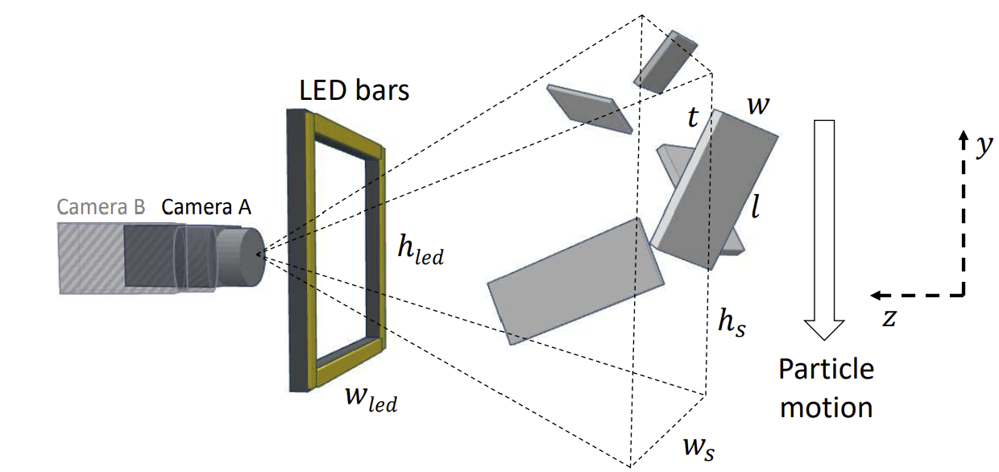
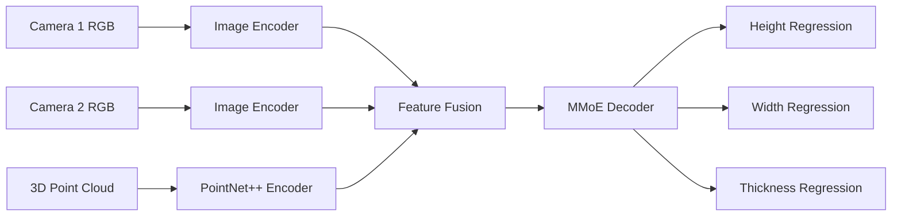

<div align="center">

# 🌲 Granulo-10k

### A large-scale benchmark dataset for multiple-view industrial granulometry of OSB wood strands

[](https://huggingface.co/datasets/AngeloUNIMI/Granulo-10k)
[](https://github.com/AngeloUNIMI/Granulo-10k)
[](https://github.com/AngeloUNIMI/IPAN_3D)
[](LICENSE)
[](#tasks)

**Granulo-10k** is an open benchmark dataset for research on **Oriented Strand Board (OSB) strand analysis**, with a focus on **multiple-view granulometry**, **strand segmentation**, and **3D geometric estimation**.

</div>

---

## 🧭 Overview

Granulo-10k contains high-resolution paired images of OSB wood strands acquired with a calibrated two-camera setup, together with segmentation masks, granulometric ground truth, and 3D point clouds.

The dataset supports reproducible research on the estimation of:

- **height** (`h`)
- **width** (`w`)
- **thickness** (`t`)
- **compliant / non-compliant strand classification**

Granulo-10k addresses a key limitation in industrial wood-vision research: many existing methods rely mainly on 2D projections and do not provide individual strand-level thickness measurements. This dataset provides synchronized multiple views and point-cloud information to encourage research on full **3D strand characterization**.

---

## ✨ Highlights

| Feature | Description |
|---|---|
| 🖼️ RGB images | **9,600** images at `1280 x 960` resolution |
| 🌲 Strands | **200** unique OSB wood strands |
| 🔁 Acquisitions | **24** acquisitions per strand |
| 📷 Views | **2 synchronized camera views** per acquisition |
| 🎯 Masks | Segmentation masks for each paired acquisition |
| ☁️ 3D data | Point clouds associated with paired acquisitions |
| 📏 Ground truth | Height, width, and thickness measurements |
| 🏷️ Labels | Compliant / non-compliant strand categories |
| 🧪 Protocol | Strand-disjoint evaluation to avoid train-test leakage |

---

## 🖼️ Visual Examples

<div align="center">


</div>

---

## 🏗️ Acquisition Setup

Images were collected using a calibrated multiple-view acquisition system composed of:

- two synchronized **Sony SX90CR** color cameras
- a trigger mechanism connected to a photocell
- four LED bars for approximately uniform illumination
- calibrated camera geometry for multiple-view reconstruction

The two cameras were placed at the same height and oriented at approximately `85°` with respect to the support, with a camera distance of `125 mm`. LED bars were placed at approximately `90 mm` from the cameras.

<div align="center">



</div>

Each strand was dropped from random positions above the cameras while ensuring that it fell inside the intersection of the two fields of view. To increase acquisition variability, each strand was acquired 24 times:

```text
200 strands x 24 acquisitions x 2 cameras = 9,600 RGB images
```

---

## 📦 Dataset Content

For each paired acquisition, Granulo-10k provides:

```text
Granulo-10k/
├── Images/        # RGB images from synchronized camera views
├── Masks/         # Segmentation masks for each view
├── PCs/           # 3D point clouds
└── README.md      # Dataset description and citation
```

Each acquisition includes:

- RGB image from camera 1
- RGB image from camera 2
- segmentation mask for camera 1
- segmentation mask for camera 2
- associated 3D point cloud
- ground-truth height, width, and thickness measurements
- compliance category

---

## 🌲 Strand Categories

The dataset includes 200 manually measured strands divided into two classes:

| Category | Number of strands | Reference average size |
|---|---:|---|
| ✅ Compliant | 100 | `h x w x t = 115 x 20 x 0.70 mm` |
| ⚠️ Non-compliant | 100 | `h x w x t = 91 x 9 x 0.65 mm` |

For each strand, maximum height and width were measured using a caliper. Since thickness can vary across the strand surface, multiple thickness measurements were collected at different points and averaged.

---

## 📥 Download

The dataset can be downloaded from Hugging Face:

```python
from datasets import load_dataset

dataset = load_dataset("AngeloUNIMI/Granulo-10k")
```

Dataset page:

```text
https://huggingface.co/datasets/AngeloUNIMI/Granulo-10k
```

---

## 🎯 Tasks

Granulo-10k supports several research tasks:

### 1. Strand segmentation
Estimate binary masks for OSB strands from single-view or paired RGB images.

### 2. Multiple-view granulometry
Estimate strand height, width, and thickness using one or more available modalities:

- image-only input
- point-cloud-only input
- fused image and point-cloud input

### 3. Compliant vs. non-compliant classification
Classify strands according to whether their geometry is compliant with manufacturer reference dimensions.

### 4. Multi-modal geometric learning
Develop methods that combine synchronized RGB views and 3D point clouds for robust geometric reasoning.

---

## 🧠 Baseline Workflow

The accompanying paper evaluates modern visual backbones and multi-modal fusion strategies for joint estimation of height, width, and thickness.



The baseline uses:

- two frozen image encoders, one for each camera view
- a PointNet++ encoder for point-cloud features
- an MLP adapter to align point-cloud and image embeddings
- max-pooling feature fusion
- a Multi-gate Mixture-of-Experts decoder
- task-specific heads for height, width, and thickness regression
- a multi-task uncertainty-weighted loss

---

## 📊 Representative Results

Values are reported as mean ± standard deviation.

| Backbone | Point cloud | Height MAE [mm] | Height MAPE [%] | Width MAE [mm] | Width MAPE [%] | Thickness MAE [mm] | Thickness MAPE [%] |
|---|:---:|---:|---:|---:|---:|---:|---:|
| Mean value baseline | - | 17.88 ± 1.45 | 21.58 ± 2.86 | 6.24 ± 0.50 | 56.22 ± 3.56 | 0.18 ± 0.03 | 29.29 ± 2.32 |
| DINO ViT-B/14 | No | 2.70 ± 0.34 | 2.99 ± 0.34 | 1.65 ± 0.21 | 12.13 ± 1.67 | 0.09 ± 0.01 | 13.70 ± 0.67 |
| ConvNeXtV2 | No | 2.95 ± 0.31 | 3.30 ± 0.37 | 1.64 ± 0.13 | 11.67 ± 1.16 | 0.09 ± 0.01 | 14.91 ± 1.52 |
| EVA02-CLIP ViT-L/14 | No | 2.82 ± 0.34 | 3.19 ± 0.35 | 1.73 ± 0.10 | 12.11 ± 0.70 | 0.09 ± 0.00 | 14.63 ± 1.33 |
| CLIP ViT-L/14 | No | 2.99 ± 0.24 | 3.34 ± 0.16 | 1.84 ± 0.17 | 13.38 ± 1.69 | 0.11 ± 0.01 | 17.77 ± 1.67 |
| **DINO ViT-B/14** | **Yes** | **2.53 ± 0.08** | **2.77 ± 0.09** | **1.59 ± 0.02** | **11.94 ± 0.35** | 0.10 ± 0.00 | 14.58 ± 0.57 |
| ConvNeXtV2 | Yes | 2.93 ± 0.16 | 3.24 ± 0.16 | 1.79 ± 0.06 | 13.94 ± 0.38 | 0.10 ± 0.00 | 15.13 ± 0.13 |
| EVA02-CLIP ViT-L/14 | Yes | 3.01 ± 0.07 | 3.31 ± 0.08 | 1.78 ± 0.07 | 13.47 ± 0.93 | 0.11 ± 0.00 | 17.44 ± 0.79 |
| CLIP ViT-L/14 | Yes | 3.41 ± 0.14 | 3.80 ± 0.12 | 2.06 ± 0.17 | 15.93 ± 2.02 | 0.13 ± 0.01 | 19.96 ± 1.19 |

DINO ViT-B/14 with point-cloud input achieves the strongest performance for height and width estimation, while thickness estimation remains the most challenging target.

---

## 🔗 Related Work: IPAN_3D

Granulo-10k is closely related to the earlier work on image-processing-based 3D granulometry.

The related repository provides MATLAB source code for the 2019 IEEE Transactions on Industrial Informatics paper:

> **3-D granulometry using image processing**  
> R. Donida Labati, A. Genovese, E. Muñoz, V. Piuri, and F. Scotti  
> *IEEE Transactions on Industrial Informatics*, vol. 15, no. 3, pp. 1251-1264, March 2019.

Useful links:

- Code: https://github.com/AngeloUNIMI/IPAN_3D
- Project page: http://iebil.di.unimi.it/projects/ipan
- Paper: https://ieeexplore.ieee.org/document/8411142

It can be considered a methodological precursor for multiple-view industrial granulometry, while Granulo-10k provides a larger benchmark dataset for modern learning-based methods using synchronized images, masks, point clouds, and strand-level granulometric ground truth.

---

## 📚 Citation

If you use Granulo-10k in your research, please cite the associated paper:

```bibtex
@inproceedings{coscia2026granulo10k,
  title     = {Granulo-10k: A Large-Scale Benchmark Dataset for Multiple-View Industrial Granulometry},
  author    = {Coscia, Pasquale and Genovese, Angelo and Piuri, Vincenzo and Scotti, Fabio},
  booktitle = {Proceedings of the IEEE International Conference on Image Processing (ICIP)},
  year      = {2026}
}
```

If you refer to the related IPAN_3D method or code, please also cite:

```bibtex
@Article{ipan3d,
  author  = {R. {Donida Labati} and A. Genovese and E. Mu\~{n}oz and V. Piuri and F. Scotti},
  title   = {3-D granulometry using image processing},
  journal = {IEEE Transactions on Industrial Informatics},
  volume  = {15},
  number  = {3},
  pages   = {1251--1264},
  month   = {March},
  year    = {2019},
  note    = {1551-3203}
}
```

---

## 🙏 Acknowledgements

This work was supported in part by the EC under project **EdgeAI** (`101097300`). Project EdgeAI is supported by the Chips Joint Undertaking and its members, including top-up funding by Austria, Belgium, France, Greece, Italy, Latvia, the Netherlands, and Norway.

The authors thank **IMAL s.r.l.**, San Damaso, Modena, Italy, for cooperation in providing data and sample classification. The authors also acknowledge Prof. **Ruggero Donida Labati** for his contribution to the data collection process.

---

## 📄 License

This repository is released under the **GNU General Public License v3.0**.

See the [LICENSE](LICENSE) file for details.

---

<div align="center">

### 🌲 Granulo-10k

**Multiple-view industrial granulometry for OSB strand analysis**

</div>
